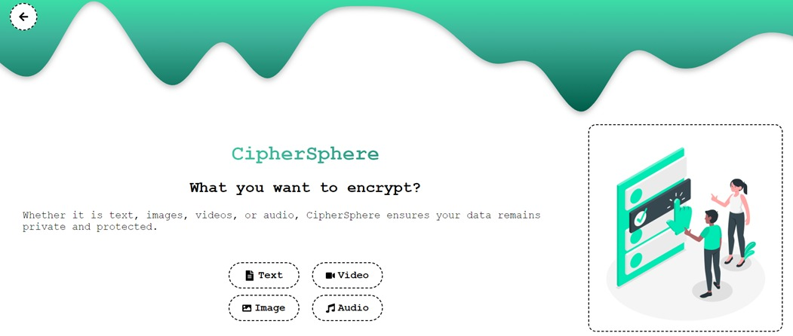

# CipherSphere 

# React TypeScript Frontend with Flask Backend

This repository contains a project with a React frontend built with TypeScript and a Flask backend. Follow the instructions below to set up and run the project locally.

## Clone the Repository

To get started, clone this repository to your local machine using the following command:

```
git clone https://github.com/m-kathyayani125/CipherSphere.git
```


## Prerequisites

Before running the project, ensure you have the following installed:

- Node.js and npm (or Yarn)
- Python (for Flask backend)

You can check if Node.js, npm (or Yarn), and Python are installed by running the following commands in your terminal:

```bash
# Check Node.js and npm
node -v
npm -v

# Check Yarn (if you prefer Yarn over npm)
yarn -v

# Check Python
python --version
```

If any of these commands show a version number, it means the respective tool is installed. If not, you'll need to install them before proceeding.

## Frontend Setup

1. Navigate to the `frontend` folder:

```
cd frontend
```

2. Install dependencies using npm or Yarn:

```bash
# If you're using npm
npm install
#OR
# If you're using Yarn
yarn install
```

3. Start the development server:

```bash
yarn run dev
```

This command will start the React development server. You can access the frontend application at `http://localhost:5173`.

## Backend Setup

1. Navigate to the `backend` folder:

```
cd ../backend
```

2. Install Flask and other Python dependencies using pip:

```bash
pip install -r requirements.txt
```

3. Install the required packages in `server.py`:

```python
# Install Flask
pip install Flask

# Install Flask-CORS
pip install flask-cors

# Install pycryptodome (for Crypto.Cipher)
pip install pycryptodome

```

4. Run the Flask server:

```bash
python server.py
```

The Flask server will start running at `http://localhost:5000`.

## Usage

Once both frontend and backend servers are running, you can interact with the application by visiting `http://localhost:5173` in your web browser.

Use samples from the `Inputs` folder to implement the code or provide input data for testing.

## Project Screenshots
Here are some key screenshots from various stages of the project:

Home Screen:


Encryption Interface:




Decryption Interface:


Text Encryption Results:


Wrong file format uploaded:


Feel free to modify the code and experiment with the project!
